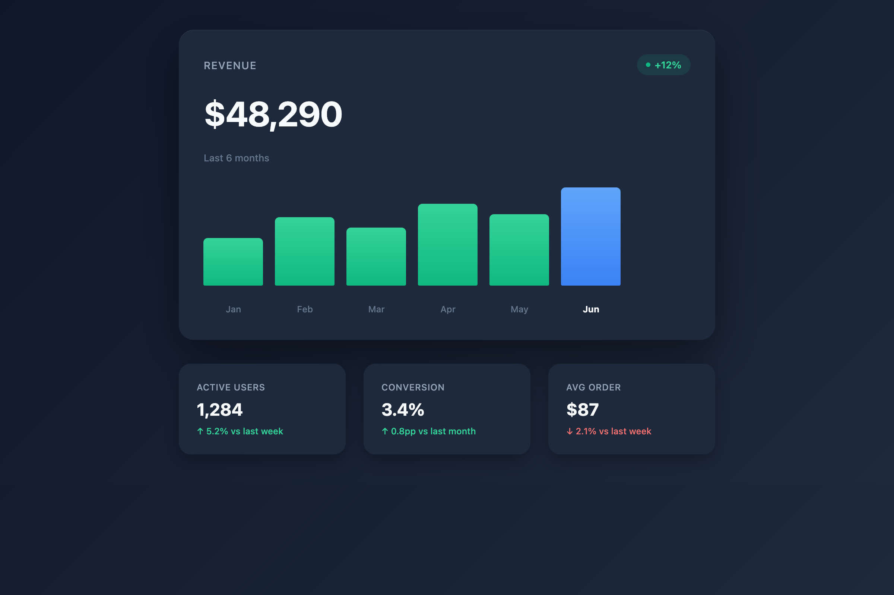

# canvas-mcp

An open-source MCP server that gives any AI assistant a visual design canvas. Uses HTML/CSS as the rendering engine — flexbox layout, text wrapping, and styling come for free.



> Above: a dashboard mock composed entirely via `batch_design` — gradients, shadows, a six-bar chart, and a responsive stat row that stacks below 768px.

```
MCP Client → stdio → canvas-mcp server
                        ↓
              Scene Graph (in-memory JSON tree)
                        ↓
              HTML/CSS Renderer (inline styles)
                        ↓
              Puppeteer (headless Chromium → PNG)
```

## Installation

### With Claude Code

```bash
claude mcp add canvas-mcp -- node /path/to/canvas-mcp/dist/index.js
```

### With npx (after publishing)

```bash
npx @canvas-mcp/server
```

### Manual

```bash
git clone https://github.com/vicmaster/canvas-mcp.git
cd canvas-mcp
npm install
npm run build
node dist/index.js
```

## Tools

### `canvas_create`

Create a new canvas. If `projectId` is omitted, it lands in the built-in `Untitled` project of the `Personal` workspace.

| Param | Type | Description |
|-------|------|-------------|
| `name` | string? | Canvas name |
| `projectId` | string? | Target project. Defaults to the built-in Untitled project. See `project_list`. |

### `canvas_list`

List canvases. Excludes archived canvases by default.

| Param | Type | Description |
|-------|------|-------------|
| `projectId` | string? | Scope to one project |
| `includeArchived` | bool? | Include archived canvases (default false) |

Returns `[{ id, name, createdAt, lastModified, projectId, archived }]`.

### `canvas_move` / `canvas_archive` / `canvas_unarchive` / `canvas_delete`

Canvas lifecycle. `canvas_move` reassigns a canvas to a different project. `canvas_archive` sets a soft-delete flag (canvas stays on disk, hidden from default `canvas_list`); `canvas_unarchive` clears it. `canvas_delete` removes the canvas and its file permanently — irreversible.

### `workspace_create` / `workspace_list` / `workspace_rename` / `workspace_delete`

Top-level container CRUD. The built-in `Personal` workspace cannot be deleted, and `workspace_delete` refuses if the workspace still contains projects (move or delete them first).

### `project_create` / `project_list` / `project_rename` / `project_delete`

Mid-level container CRUD inside a workspace. The built-in `Untitled` project cannot be deleted. `project_delete` refuses if the project still contains any canvases (archived ones still count — move or delete them first).

### `batch_design`

Execute operations on the scene graph. Operations are line-separated strings:

```
# Insert a frame into the document root
header=I("document", { type: "frame", layout: "horizontal", fill: "#1a1a2e", padding: 24, gap: 16, width: 1440, height: 80 })

# Insert text into the header
I(header, { type: "text", content: "My App", fontSize: 24, fontWeight: 700, color: "#ffffff" })

# Update a node
U("nodeId", { fill: "#e94560" })

# Delete a node
D("nodeId")

# Copy a node to a new parent
copy=C("sourceId", "parentId", { fill: "#0f3460" })

# Move a node
M("nodeId", "newParentId", 0)

# Replace a node entirely
R("nodeId", { type: "text", content: "Replaced" })
```

**Node types:** `frame`, `text`, `rectangle`, `ellipse`, `image`, `icon`, `path`, `component`, `instance`

**Properties:** `fill`, `gradient`, `stroke`, `strokeWidth`, `cornerRadius`, `width`, `height`, `layout` (`"horizontal"` | `"vertical"`), `gap`, `padding`, `alignItems`, `justifyContent`, `fontSize`, `fontFamily`, `fontWeight`, `color`, `content`, `src`, `objectFit`, `opacity`, `shadow`, `shadows`, `blur`, `backdropBlur`, `backdropFilter`, `overflow`, `wrap`, `position`, `x`, `y`, `icon`, `iconSize`, `iconColor`, `d`, `viewBox`, `strokeLinecap`, `strokeLinejoin`, `animation`, `transition`, `componentId`, `overrides`

### `screenshot`

Render canvas to PNG (returned as base64 image).

| Param | Type | Description |
|-------|------|-------------|
| `canvasId` | string | Canvas ID |
| `nodeId` | string? | Specific node to capture |
| `width` | number? | Viewport width (default 1440) |
| `height` | number? | Viewport height (default 900) |
| `scale` | number? | Device scale (default 2) |

### `read_nodes`

Read node data from the scene graph.

| Param | Type | Description |
|-------|------|-------------|
| `canvasId` | string | Canvas ID |
| `nodeIds` | string[]? | Node IDs to read (default: root) |
| `maxDepth` | number? | Max traversal depth (default 5) |

### `snapshot_layout`

Get computed bounding boxes via browser rendering.

| Param | Type | Description |
|-------|------|-------------|
| `canvasId` | string | Canvas ID |
| `nodeId` | string? | Root node to start from |
| `maxDepth` | number? | Max depth (default 10) |

### `get_variables` / `set_variables`

Read and write design tokens (colors, spacing, radius, typography). Use `$tokenName` in node properties to reference variables.

```json
{
  "colors": { "primary": "#e94560", "bg": "#1a1a2e" },
  "spacing": { "sm": 8, "md": 16, "lg": 24 },
  "radius": { "sm": 4, "md": 8 }
}
```

Then use in nodes: `{ fill: "$primary", padding: "$md", cornerRadius: "$sm" }`

### `get_fonts` / `set_fonts`

Register custom font faces on a canvas. The renderer emits `@font-face` blocks in `<head>` plus a `<link rel="preconnect">` for unique remote origins, and declares `font-display: swap` so paint isn't blocked while a font loads.

```json
{
  "fonts": [
    { "family": "Inter", "url": "https://fonts.gstatic.com/s/inter/v18/...regular.woff2", "weight": 400 },
    { "family": "Inter", "url": "https://fonts.gstatic.com/s/inter/v18/...bold.woff2",    "weight": 700 }
  ]
}
```

URLs must point at the binary (`.woff2` / `.woff` / `.ttf` / `.otf` or a `data:` URI) — Google Fonts CSS stylesheet URLs (`fonts.googleapis.com/css2`) are not supported, use the gstatic.com binary URL directly. After registering, reference the family on any text node: `fontFamily: "Inter, system-ui, sans-serif"`.

### `export`

Export a canvas or specific nodes to files on disk.

| Param | Type | Description |
|-------|------|-------------|
| `canvasId` | string | Canvas ID |
| `format` | string | `"png"`, `"jpeg"`, `"webp"`, or `"pdf"` |
| `outputPath` | string | Directory to save files |
| `nodeIds` | string[]? | Specific nodes to export (default: full canvas) |
| `width` | number? | Viewport width (default 1440) |
| `height` | number? | Viewport height (default 900) |
| `scale` | number? | Device scale (default 2) |

### `list_presets`

List available style guide presets. No params. Returns preset names and descriptions.

### `apply_preset`

Apply a style guide preset to a canvas. Merges preset design tokens into the canvas variables, and copies in any reusable components (`button`, `card`, `badge`) the preset defines so they can be instanced.

| Param | Type | Description |
|-------|------|-------------|
| `canvasId` | string | Canvas ID |
| `preset` | string | Preset name: `"dark"`, `"light"`, `"material"`, `"minimal"` |

### `import_design_md`

Import a [DESIGN.md](https://github.com/VoltAgent/awesome-design-md) file as a design system preset. Parses the Google Stitch format and extracts colors, typography, spacing, and border radius. It also extracts reusable component skeletons (`button`, `card`, `badge`) from the "Component Styling" section — `apply_preset` then makes them available as instanceable components on the canvas. After importing, use `apply_preset` to apply it to any canvas.

| Param | Type | Description |
|-------|------|-------------|
| `content` | string? | Raw DESIGN.md content (provide this OR `filePath`) |
| `filePath` | string? | Absolute path to a DESIGN.md file |
| `name` | string? | Override the preset name |

Compatible with the 55+ design systems in [awesome-design-md](https://github.com/VoltAgent/awesome-design-md) (Stripe, Notion, Figma, Vercel, Linear, etc.).

### `screenshot_responsive`

Render a canvas at multiple viewport sizes. Defaults to mobile (390x844), tablet (768x1024), and desktop (1440x900).

The renderer emits `clamp()` for paddings ≥ 32px and font sizes ≥ 24px, so headlines and large spacing shrink proportionally at narrower viewports (assuming a 1440px design width). Smaller values stay static.

| Param | Type | Description |
|-------|------|-------------|
| `canvasId` | string | Canvas ID |
| `breakpoints` | array? | `[{label, width, height}]` — custom breakpoints |
| `scale` | number? | Device scale (default 2) |

### `canvas_diff`

Compare two canvases visually. Returns a diff image with changed regions highlighted in red.

| Param | Type | Description |
|-------|------|-------------|
| `canvasId1` | string | First canvas ID |
| `canvasId2` | string | Second canvas ID |
| `width` | number? | Viewport width (default 1440) |
| `height` | number? | Viewport height (default 900) |
| `scale` | number? | Device scale (default 1) |

### `canvas_evaluate`

Auto-score a design against quality heuristics. Returns an overall score (0–100), per-category scores, and per-node actionable issues. Designed for generator-evaluator loops: build with `batch_design`, score with `canvas_evaluate`, fix the issues targeting the returned `nodeId`s, repeat.

| Param | Type | Description |
|-------|------|-------------|
| `canvasId` | string | Canvas ID to evaluate |
| `mode` | `"fast"` \| `"detailed"` \| `"llm"` | `"fast"` = JSON-tree analysis only (<100ms). `"detailed"` adds Puppeteer-based pixel-level overlap checks. `"llm"` runs fast-mode heuristics plus a vision-model critique (provider picked from `CANVAS_LLM_PROVIDER` or whichever of `ANTHROPIC_API_KEY` / `OPENAI_API_KEY` is set — costs one paid API call per invocation). Default `"fast"`. |
| `categories` | string[]? | Subset of `spacing`, `color`, `typography`, `structure`, `consistency`. Defaults to all. |

**Categories and what they check**

| Category | Weight | Checks |
|----------|--------|--------|
| `spacing` | 20 | Off-scale padding/gap values, too many unique spacing values |
| `color` | 25 | WCAG AA contrast ratios for text against nearest background |
| `typography` | 20 | Type-scale ratios (1.15–1.75), font-family count, weight variation |
| `structure` | 15 | Tree depth, naming coverage, design-token usage %, component reuse |
| `consistency` | 20 | Frames missing `layout`, inconsistent sibling padding, sibling overlap (detailed mode) |

**Return shape**

```json
{
  "overallScore": 87,
  "categories": [{ "name": "spacing", "score": 90, "issueCount": 1, "weight": 20 }],
  "issues": [
    {
      "category": "color",
      "severity": "error",
      "nodeId": "abc123",
      "message": "Text \"Sign In\" has contrast ratio 2.8:1 against #1a1a2e. WCAG AA requires 4.5:1.",
      "suggestion": "Increase contrast by darkening/lightening the text or background."
    }
  ],
  "summary": "Overall quality: Good (87/100). Strongest: spacing (90/100). Weakest: color (75/100)...",
  "stats": { "totalNodes": 14, "textNodes": 5, "frameNodes": 8, "maxDepth": 4, "tokenUsagePercent": 61, "componentReusePercent": 0 },
  "mode": "fast"
}
```

**With `mode: "llm"`**, the response additionally carries:

```json
{
  "llmCritique": {
    "provider": "anthropic",
    "model": "claude-sonnet-4-6",
    "score": 84,
    "summary": "Clean dashboard layout with a strong primary metric and clear hierarchy.",
    "strengths": ["balanced spacing", "consistent type scale"],
    "weaknesses": ["stat tiles sit slightly below the card's baseline"],
    "suggestions": ["align the stat row to the card's bottom edge for a tighter composition"]
  }
}
```

Provider selection: `CANVAS_LLM_PROVIDER` env var (`anthropic` | `openai`), else falls back to whichever of `ANTHROPIC_API_KEY` / `OPENAI_API_KEY` is set. Default models: `claude-sonnet-4-6` / `gpt-4.1` (override via `CANVAS_LLM_ANTHROPIC_MODEL` / `CANVAS_LLM_OPENAI_MODEL`). Adding a third provider is one entry in the `judges` table in `src/llm-judge.ts`.

**Example generator-evaluator loop**

```
batch_design({ canvasId, operations: "..." })
const r = canvas_evaluate({ canvasId, mode: "fast" })
// r.issues[].nodeId points to exactly what to fix
batch_design({ canvasId, operations: `U("${r.issues[0].nodeId}", { color: "#ffffff" })` })
canvas_evaluate({ canvasId })  // re-score
```

Issues that have a mechanical fix come back with an extra `fix: { op, rationale }` field — see `canvas_autofix` below.

### `canvas_autofix`

Runs `canvas_evaluate` in fast mode and returns just the subset of issues with a mechanically derived fix — no judgement calls. Each fix carries a ready-to-paste `batch_design` Update op string. Closes the generator-evaluator loop without a second AI hop.

| Param | Type | Description |
|-------|------|-------------|
| `canvasId` | string | Canvas to autofix |
| `categories` | string[]? | Restrict to fixes from these categories (default: all) |

**What gets auto-fixed**

- **Spacing** — off-scale `gap` or scalar `padding` snaps to the nearest scale value. Array `padding` is skipped (ambiguous which index).
- **Consistency** — frames with multiple children but no `layout` get `layout: "vertical"`.
- **Color** — recoverable WCAG contrast failures get `color: "#000000"` or `"#FFFFFF"`, whichever wins against the resolved background. Failures so bad that neither black nor white meets the threshold are not auto-fixed (the background also needs to change).

**Return shape**

```json
{
  "totalIssues": 18,
  "fixableCount": 5,
  "fixes": [
    {
      "nodeId": "abc123",
      "category": "color",
      "op": "U(\"abc123\", { color: \"#000000\" })",
      "rationale": "Switch text color to #000000 for WCAG AA contrast against #F8FAFC",
      "message": "Text \"Sign In\" has contrast ratio 2.8:1 against #F8FAFC. WCAG AA requires 4.5:1."
    }
  ]
}
```

Apply the ops by joining them with newlines and passing to `batch_design`, then re-evaluate.

## Resources

- **`canvas-mcp://guidelines`** — markdown authoring guide: width strategies (fixed / percentage / fluid+cap / floor / fit-content), responsive hint semantics (`stack` / `wrap` / `fixed`), common patterns (pricing tiers, two-column hero, tag list, toolbar), and anti-patterns. Source: [`docs/GUIDELINES.md`](docs/GUIDELINES.md).

## Benchmark

`npm run bench` runs `canvas_evaluate` over a fixed corpus of canvases (a high-quality dashboard hero, a minimal well-formed canvas, an intentional-contrast-failure canvas) and diffs the result against [`benchmark/baselines.json`](benchmark/baselines.json). Catches drift in scoring across renderer / evaluator changes — exit code is nonzero on any score, issue-count, or issue-message change. Re-baseline with `npx tsx benchmark/run.ts --update` after intentional evaluator rewrites.

## Gradients

Nodes support linear and radial gradients via the `gradient` property:

```
# Linear gradient (angle in degrees)
I("parent", { type: "frame", width: 400, height: 200, gradient: { type: "linear", angle: 135, stops: [{color: "#667eea", position: 0}, {color: "#764ba2", position: 100}] } })

# Radial gradient
I("parent", { type: "frame", width: 200, height: 200, gradient: { type: "radial", stops: [{color: "#fff", position: 0}, {color: "#000", position: 100}] } })
```

When `gradient` is set, it takes precedence over `fill`. Both can coexist (`fill` as fallback).

## Shadows & Blur

Structured shadows, blur filters, and backdrop blur:

```
# Structured shadow (supports multiple shadows)
I("parent", { type: "frame", fill: "#fff", shadows: [{x: 0, y: 4, blur: 12, spread: 0, color: "rgba(0,0,0,0.15)"}] })

# Blur filter
I("parent", { type: "frame", fill: "#3b82f6", blur: 4 })

# Backdrop blur (single-function shorthand for `blur`)
I("parent", { type: "frame", fill: "rgba(255,255,255,0.5)", backdropBlur: 8 })

# Glassmorphism (composable backdrop-filter: blur + saturate + brightness + contrast)
I("parent", {
  type: "frame",
  fill: "rgba(255, 255, 255, 0.4)",
  backdropFilter: { blur: 12, saturate: 180, brightness: 110 }
})
```

The structured `backdropFilter` form takes precedence over `backdropBlur` when both are set. The renderer also emits the `-webkit-backdrop-filter` prefix so glass effects render in Safari/iOS without extra work.

The legacy `shadow` string property still works for simple cases.

## Icons

1,900+ icons from [Lucide](https://lucide.dev) are available via the `icon` node type:

```
I("parent", { type: "icon", icon: "search", iconSize: 24, iconColor: "#888" })
I("parent", { type: "icon", icon: "heart", iconSize: 32, iconColor: "#ef4444" })
```

Icons render as inline SVGs with configurable size and color.

## SVG Paths

For custom shapes and brand marks beyond the Lucide library, use the `path` node type with a raw SVG `d` attribute:

```
I("parent", { type: "path", width: 24, height: 24,
  d: "M 12 2 L 22 22 L 2 22 Z", fill: "#f59e0b" })

# With stroke + viewBox (defaults to `0 0 width height`)
I("parent", { type: "path", width: 48, height: 48, viewBox: "0 0 24 24",
  d: "M 12 2 L 22 22 L 2 22 Z",
  fill: "none", stroke: "#000", strokeWidth: 2,
  strokeLinecap: "round", strokeLinejoin: "round" })
```

`fill`/`stroke`/`strokeWidth` apply to the path itself (not the wrapper). `d` and `viewBox` are validated for safe characters — anything that could break out of the attribute is rejected.

## Animations & Transitions

Reference a built-in keyframe to make a node animate in on page load. The renderer auto-emits the `@keyframes` block only when referenced.

```
I("hero", { type: "frame", animation: { name: "fadeIn", duration: 400 } })
I("title", { type: "text", animation: { name: "slideUp", duration: 300, delay: 100 } })
```

Built-in keyframe names: `fadeIn`, `slideUp`, `slideDown`, `scaleIn`. All end at the natural resting state with `animation-fill-mode: both`, so the start state applies pre-animation and the end state sticks after.

`animation`: `{ name, duration?: 300ms, delay?: 0ms, easing?: "ease-out", iteration?: 1 | "infinite" }`. Easing is whitelisted: `ease`, `ease-in`, `ease-out`, `ease-in-out`, `linear` (anything else falls back to `ease-out`).

`transition`: `{ property?: "all", duration, easing?: "ease", delay?: 0ms }`. Transitions only fire on state change, so they're inert until interactive states exist in the renderer — included today so a future hover/focus PR has a place to land.

## Components

Define reusable components and create instances with overrides:

```
# Define a component (a frame subtree that gets registered)
card=I("document", { type: "component", name: "Card", width: 300, fill: "#1a1a1a", cornerRadius: 12, layout: "vertical", padding: 16, gap: 8 })
I(card, { type: "text", name: "title", content: "Default Title", fontSize: 20, color: "#fff" })
I(card, { type: "text", name: "subtitle", content: "Default subtitle", fontSize: 14, color: "#888" })

# Create instances with overrides (matched by child name)
I("document", { type: "instance", componentId: card, overrides: { title: { content: "My Card" }, subtitle: { content: "Custom text" } } })
```

## Usage Example

Here's a complete session building a login card:

**1. Create a canvas and set design tokens**

```
canvas_create({ name: "Login" })
→ { canvasId: "abc123" }

set_variables({
  canvasId: "abc123",
  variables: {
    colors: { bg: "#0a0a0a", surface: "#1a1a2e", accent: "#e94560", text: "#ffffff" },
    spacing: { sm: 8, md: 16, lg: 24, xl: 32 },
    radius: { md: 8, lg: 16 }
  }
})
```

**2. Build the layout with `batch_design`**

```
batch_design({
  canvasId: "abc123",
  operations: `
    page=I("document", { type: "frame", width: 1440, height: 900, fill: "$bg", layout: "vertical", alignItems: "center", justifyContent: "center" })
    card=I(page, { type: "frame", width: 400, fill: "$surface", cornerRadius: "$lg", padding: [32, 32, 32, 32], layout: "vertical", gap: 24 })
    I(card, { type: "text", content: "Sign In", fontSize: 28, fontWeight: 700, color: "$text" })
    I(card, { type: "frame", width: "100%", height: 44, fill: "#ffffff10", cornerRadius: "$md", padding: [0, 16, 0, 16], layout: "horizontal", alignItems: "center" })
    I(card, { type: "frame", width: "100%", height: 44, fill: "#ffffff10", cornerRadius: "$md", padding: [0, 16, 0, 16], layout: "horizontal", alignItems: "center" })
    btn=I(card, { type: "frame", width: "100%", height: 44, fill: "$accent", cornerRadius: "$md", layout: "horizontal", alignItems: "center", justifyContent: "center" })
    I(btn, { type: "text", content: "Continue", fontSize: 16, fontWeight: 600, color: "$text" })
  `
})
```

**3. Take a screenshot to see the result**

```
screenshot({ canvasId: "abc123" })
→ returns base64 PNG image
```

**4. Iterate — update the button color and verify**

```
batch_design({
  canvasId: "abc123",
  operations: `U("btn-id", { fill: "#3b82f6" })`
})

screenshot({ canvasId: "abc123" })
```

## Web Viewer

The server includes a built-in web viewer that starts automatically on port **3001** (or the next available port if 3001 is in use — supports multiple sessions).

- **Gallery** (`/`) — Browse all canvases as clickable cards with thumbnails
- **Canvas detail** (`/canvas/:id`) — Full rendered design in an iframe with responsive viewport buttons (Mobile / Tablet / Desktop), fit-to-screen toggle, and JSON inspector
- **Live auto-refresh** — The viewer polls for changes every 2 seconds. As you `batch_design` via your MCP client, the browser updates automatically
- **Raw HTML** (`/canvas/:id/html`) — The rendered HTML for embedding or inspection
- **JSON API** (`/api/canvases`, `/api/canvas/:id/meta`) — Programmatic access

### Standalone Viewer (recommended)

By default, the viewer runs inside the MCP server process — when the Claude session ends, the viewer stops and URLs become unreachable. To keep the viewer alive across sessions, run it as a standalone process:

```bash
# In a separate terminal tab (stays alive independently)
cd /path/to/canvas-mcp
npm run viewer

# Or on a specific port
npm run viewer -- 3004
```

The standalone viewer:

- **Persists across sessions** — URLs keep working after Claude finishes
- **Shared across projects** — Multiple Claude sessions (from different projects) all use the same viewer
- **Auto-detects new canvases** — Watches `~/.canvas-mcp/canvases/` for changes and picks them up automatically
- **Auto-detected by MCP** — When the MCP server starts, it probes for a running standalone viewer and uses it instead of starting its own

All canvases are persisted to `~/.canvas-mcp/canvases/` as JSON files, so they survive process restarts.

You can also set `CANVAS_VIEWER_URL` in your MCP server environment to explicitly point to a viewer instance:

```bash
claude mcp add canvas-mcp -e CANVAS_VIEWER_URL=http://localhost:3004 -- node /path/to/canvas-mcp/dist/index.js
```

## Workflow

1. Start the standalone viewer in a terminal tab: `npm run viewer`
2. `canvas_create` → get canvas ID
3. Open the viewer URL in your browser for live preview
4. `apply_preset` or `set_variables` → set up design tokens
5. `batch_design` → build the UI with frames, text, icons, components, gradients
6. Watch the viewer auto-refresh as you design
7. `screenshot_responsive` → preview at mobile/tablet/desktop sizes
8. `canvas_diff` → compare before/after changes visually
9. `export` → save final designs to PNG/PDF files

## Development

```bash
git clone https://github.com/vicmaster/canvas-mcp.git
cd canvas-mcp
npm install
npm run build
```

### Scripts

| Command | What it does |
|---------|--------------|
| `npm run build` | Compile TypeScript to `dist/`. Required before the installed MCP server picks up changes — it loads `dist/index.js`. |
| `npm run dev` | Run the server directly via `tsx` for local iteration. Does not affect the registered MCP server. |
| `npm run viewer [port]` | Start the standalone viewer (default auto-picks from 3001). |
| `npx tsx test-*.ts` | Run ad-hoc test scripts at the repo root. |

### Env vars

| Variable | Purpose |
|----------|---------|
| `CANVAS_VIEWER_URL` | Point the MCP server at an external viewer (skips starting an embedded one). |
| `CANVAS_VIEWER_PORT` | Override the standalone viewer's port. |

### Conventions

- ESM only (`"type": "module"`). Imports in TypeScript source use `.js` extensions even when the source file is `.ts`.
- Don't edit `dist/` — it's regenerated by `tsc`.
- New MCP tool? Register it in `src/index.ts`, document it in the Tools section above, and update `VISION.md`'s phase checklist.

## License

MIT
